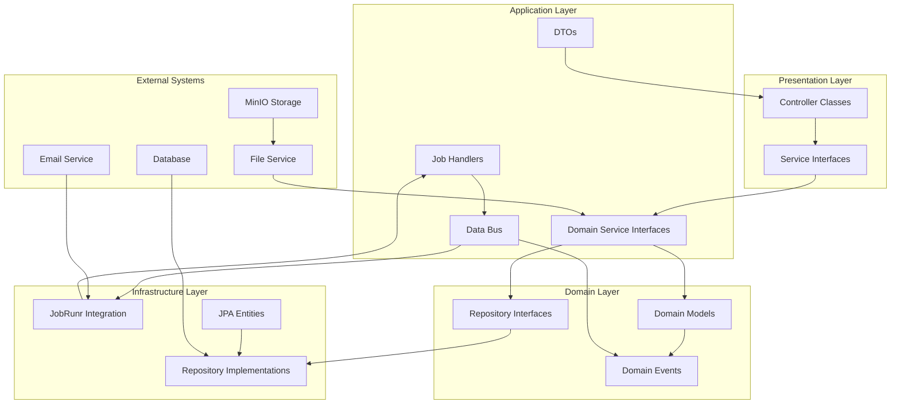

# Архитектурный план T-Event (исправленная версия)

## Обзор
Создание Java интерфейсов на основе OpenAPI контракта с использованием паттерна "абстрактная шина данных" и Jobrunr.

**Важные уточнения:**
- Контроллеры делаем как обычные классы (не интерфейсы)
- Сервисы и репозитории - интерфейсы (этап проектирования)
- Учет замечаний по API спецификации

## Исправления к OpenAPI спецификации

### 1. POST /events
- `category` - массив категорий (уже правильно в спецификации)

### 2. Статус событий
- Статус определяется автоматически на бэкенде на основе дат начала и окончания

### 3. GET /user/events
- Добавить query-параметры для фильтрации по минимальному и максимальному количеству участников:
  - `minParticipants` (опционально)
  - `maxParticipants` (опционально)

### 4. POST /events/{eventId}/expenses
- Добавить поле `participantIds` - массив ID участников, между которыми будет разделена сумма
- Убрать поле с количеством людей (рассчитывается автоматически из participantIds)

### 5. PATCH /me
- Добавить возможность редактировать email (так как при регистрации email не задается)
- Обновить схему `UpdateProfileRequest` для включения email

### 6. Исправления кодов ответов
- `POST /user/invitations/:invitationId/resolve`: 200 → 204 (No Content)
- `PATCH /expenses/:expenseId/status`: 200 → 204 (No Content)
- `POST /settlements/:settlementId/pay`: 200 → 204 (No Content)
- `POST /settlements/:settlementId/confirm`: 200 → 204 (No Content)
- `PATCH /me`: 200 → 204 (No Content)

### 7. Исправления кодов ошибок
- `POST /settlements/:settlementId/pay`: 400 → 409 (Conflict) при бизнес-ограничениях
- `POST /settlements/:settlementId/confirm`: 400 → 409 (Conflict) при бизнес-ограничениях
- `POST /groups/join`: 202 → 201 (Created) если заявка сразу принимается

## Структура пакетов

```
com.tbank.tevent
├── application
│   ├── dto
│   │   ├── request
│   │   ├── response
│   │   └── internal
│   ├── service          # интерфейсы сервисов
│   ├── controller       # классы контроллеров
│   └── job
│       └── handler      # интерфейсы обработчиков заданий
├── domain
│   ├── model           # доменные модели
│   ├── repository      # интерфейсы репозиториев
│   ├── service         # интерфейсы доменных сервисов
│   └── event           # доменные события
├── infrastructure
│   ├── persistence
│   │   ├── entity      # JPA сущности
│   │   └── repository
│   │       └── impl    # реализации репозиториев
│   ├── messaging
│   │   ├── bus         # шина данных
│   │   └── jobrunr     # интеграция с Jobrunr
│   └── config
└── shared
    ├── exception
    ├── validation
    └── util
```

## DTO классы (с учетом исправлений)

### Request DTOs
1. **AuthRequest** - для регистрации/входа
2. **CreateEventRequest** - создание события (category как List<EventCategory>)
3. **UpdateEventRequest** - обновление события
4. **CreateExpenseRequest** - создание расхода (с полем participantIds: List<Long>)
5. **UpdateProfileRequest** - обновление профиля (добавить email)
6. **PasswordChangeRequest** - смена пароля
7. **EventFilterRequest** - фильтр для GET /user/events (minParticipants, maxParticipants)

### Response DTOs
1. **AuthResponse** - ответ аутентификации
2. **EventResponse** - полная информация о событии
3. **UserEventDTO** - краткая информация о событии для списка
4. **EventHeaderDTO** - заголовок события
5. **ParticipantDTO** - информация об участнике
6. **PendingInvitationResponse** - информация о приглашении
7. **ExpenseDTO** - информация о расходе
8. **SettlementDTO** - информация о взаиморасчете
9. **UserShortDTO** - краткая информация о пользователе
10. **HistoryItemDTO** - элемент истории
11. **LeaveCheckResponse** - проверка возможности выхода
12. **UserProfileDTO** - профиль пользователя
13. **InviteLinkDTO** - пригласительная ссылка
14. **ErrorResponse** - ошибка API

## Интерфейсы Repository (исправленные)

```java
// Базовый интерфейс репозитория
public interface BaseRepository<T, ID> {
    Optional<T> findById(ID id);
    List<T> findAll();
    T save(T entity);
    void delete(T entity);
    void deleteById(ID id);
}

// Специализированные репозитории
public interface EventRepository extends BaseRepository<Event, Long> {
    List<Event> findByOwnerId(Long ownerId);
    List<Event> findByParticipantId(Long participantId);
    Optional<Event> findByInviteToken(String token);
    List<Event> findByParticipantsCountBetween(Integer minParticipants, Integer maxParticipants);
}

public interface UserRepository extends BaseRepository<User, Long> {
    Optional<User> findByUsername(String username);
    Optional<User> findByEmail(String email);
    boolean existsByUsername(String username);
    boolean existsByEmail(String email);
}

public interface ParticipantRepository extends BaseRepository<Participant, Long> {
    List<Participant> findByEventId(Long eventId);
    Optional<Participant> findByEventIdAndUserId(Long eventId, Long userId);
    List<Participant> findConfirmedByEventId(Long eventId);
    Integer countConfirmedByEventId(Long eventId);
}

public interface ExpenseRepository extends BaseRepository<Expense, Long> {
    List<Expense> findByEventId(Long eventId);
    List<Expense> findByPayerId(Long payerId);
    List<Expense> findByEventIdAndApprovalStatus(Long eventId, ApprovalStatus status);
    List<Expense> findByParticipantIdsContaining(Long participantId);
}

public interface SettlementRepository extends BaseRepository<Settlement, Long> {
    List<Settlement> findByFromUserId(Long userId);
    List<Settlement> findByToUserId(Long userId);
    List<Settlement> findByEventId(Long eventId);
    List<Settlement> findByStatus(SettlementStatus status);
    List<Settlement> findByFromUserIdAndStatus(Long userId, SettlementStatus status);
    List<Settlement> findByToUserIdAndStatus(Long userId, SettlementStatus status);
}
```

## Детальные интерфейсы Service

### Базовые интерфейсы

```java
package com.tbank.tevent.domain.service;

import java.util.List;
import java.util.Optional;

/**
 * Базовый интерфейс для CRUD операций
 */
public interface CrudService<T, ID, RQ, RS> {
    RS create(RQ request);
    Optional<RS> findById(ID id);
    List<RS> findAll();
    RS update(ID id, RQ request);
    void delete(ID id);
}

/**
 * Базовый интерфейс для сервисов с фильтрацией
 */
public interface FilterableService<T, ID, RQ, RS, F> extends CrudService<T, ID, RQ, RS> {
    List<RS> findAll(F filter);
    Page<RS> findPage(F filter, Pageable pageable);
}
```

### AuthService

```java
package com.tbank.tevent.application.service;

import com.tbank.tevent.application.dto.request.AuthRequest;
import com.tbank.tevent.application.dto.response.AuthResponse;

public interface AuthService {
    
    /**
     * Регистрация нового пользователя
     */
    AuthResponse register(AuthRequest request);
    
    /**
     * Аутентификация существующего пользователя
     */
    AuthResponse login(AuthRequest request);
    
    /**
     * Выход из системы (инвалидация токенов)
     */
    void logout();
    
    /**
     * Обновление access token с помощью refresh token
     */
    void refreshToken();
    
    /**
     * Проверка доступности username
     */
    boolean isUsernameAvailable(String username);
    
    /**
     * Восстановление пароля
     */
    void requestPasswordReset(String email);
    
    /**
     * Сброс пароля по токену
     */
    void resetPassword(String token, String newPassword);
}
```

### EventService

```java
package com.tbank.tevent.application.service;

import com.tbank.tevent.application.dto.request.CreateEventRequest;
import com.tbank.tevent.application.dto.request.UpdateEventRequest;
import com.tbank.tevent.application.dto.request.EventFilterRequest;
import com.tbank.tevent.application.dto.response.EventResponse;
import com.tbank.tevent.application.dto.response.UserEventDTO;
import com.tbank.tevent.application.dto.response.EventHeaderDTO;
import com.tbank.tevent.application.dto.response.InviteLinkDTO;
import com.tbank.tevent.application.dto.response.LeaveCheckResponse;
import com.tbank.tevent.domain.model.EventStatus;

import java.util.List;

public interface EventService extends CrudService<Event, Long, CreateEventRequest, EventResponse> {
    
    /**
     * Обновление события (частичное обновление)
     */
    EventResponse updateEvent(Long eventId, UpdateEventRequest request);
    
    /**
     * Получение событий пользователя с фильтрацией
     */
    List<UserEventDTO> getUserEvents(EventFilterRequest filter);
    
    /**
     * Получение заголовка события (для карточек)
     */
    EventHeaderDTO getEventHeader(Long eventId);
    
    /**
     * Генерация пригласительной ссылки
     */
    InviteLinkDTO generateInviteLink(Long eventId);
    
    /**
     * Проверка возможности покинуть событие
     */
    LeaveCheckResponse checkLeavePossibility(Long eventId);
    
    /**
     * Выход из события
     */
    void leaveEvent(Long eventId);
    
    /**
     * Расчет статуса события на основе дат
     */
    EventStatus calculateEventStatus(Event event);
    
    /**
     * Получение событий по категории
     */
    List<EventResponse> getEventsByCategory(EventCategory category);
    
    /**
     * Поиск событий по названию
     */
    List<EventResponse> searchEvents(String query);
    
    /**
     * Архивирование завершенных событий
     */
    void archiveCompletedEvents();
}
```

### ParticipantService

```java
package com.tbank.tevent.application.service;

import com.tbank.tevent.application.dto.response.ParticipantDTO;
import com.tbank.tevent.application.dto.response.PendingInvitationResponse;
import com.tbank.tevent.domain.model.ParticipantRole;

import java.util.List;

public interface ParticipantService {
    
    /**
     * Добавление участника в событие
     */
    ParticipantDTO addParticipant(Long eventId, Long userId);
    
    /**
     * Удаление участника из события
     */
    void removeParticipant(Long eventId, Long userId);
    
    /**
     * Получение списка участников события
     */
    List<ParticipantDTO> getEventParticipants(Long eventId);
    
    /**
     * Изменение роли участника
     */
    void changeParticipantRole(Long eventId, Long userId, ParticipantRole role);
    
    /**
     * Получение ожидающих приглашений пользователя
     */
    List<PendingInvitationResponse> getPendingInvitations();
    
    /**
     * Ответ на приглашение
     */
    void respondToInvitation(Long invitationId, boolean accept);
    
    /**
     * Приглашение участника по email или username
     */
    void inviteParticipant(Long eventId, String emailOrUsername);
    
    /**
     * Отмена приглашения
     */
    void cancelInvitation(Long invitationId);
    
    /**
     * Подтверждение участия (для приглашенных)
     */
    void confirmParticipation(Long eventId);
    
    /**
     * Получение роли пользователя в событии
     */
    ParticipantRole getUserRoleInEvent(Long eventId, Long userId);
    
    /**
     * Проверка, является ли пользователь участником события
     */
    boolean isUserParticipant(Long eventId, Long userId);
}
```

### ExpenseService

```java
package com.tbank.tevent.application.service;

import com.tbank.tevent.application.dto.request.CreateExpenseRequest;
import com.tbank.tevent.application.dto.response.ExpenseDTO;
import com.tbank.tevent.domain.model.ApprovalStatus;

import java.math.BigDecimal;
import java.util.List;
import java.util.Map;

public interface ExpenseService extends CrudService<Expense, Long, CreateExpenseRequest, ExpenseDTO> {
    
    /**
     * Обновление расхода
     */
    ExpenseDTO updateExpense(Long expenseId, CreateExpenseRequest request);
    
    /**
     * Получение расходов события
     */
    List<ExpenseDTO> getEventExpenses(Long eventId);
    
    /**
     * Подтверждение расхода
     */
    void confirmExpense(Long expenseId);
    
    /**
     * Оспаривание расхода
     */
    void disputeExpense(Long expenseId, String reason);
    
    /**
     * Расчет сумм для каждого участника
     */
    Map<Long, BigDecimal> calculateSplitAmounts(BigDecimal totalAmount, List<Long> participantIds);
    
    /**
     * Получение расходов по статусу подтверждения
     */
    List<ExpenseDTO> getExpensesByStatus(Long eventId, ApprovalStatus status);
    
    /**
     * Получение расходов, где пользователь является плательщиком
     */
    List<ExpenseDTO> getUserExpensesAsPayer(Long userId);
    
    /**
     * Получение расходов, где пользователь является участником
     */
    List<ExpenseDTO> getUserExpensesAsParticipant(Long userId);
    
    /**
     * Расчет общей суммы расходов события
     */
    BigDecimal calculateTotalExpenses(Long eventId);
    
    /**
     * Расчет средней суммы на участника
     */
    BigDecimal calculateAveragePerParticipant(Long eventId);
}
```

### SettlementService

```java
package com.tbank.tevent.application.service;

import com.tbank.tevent.application.dto.response.SettlementDTO;
import com.tbank.tevent.domain.model.SettlementStatus;

import java.util.List;

public interface SettlementService {
    
    /**
     * Расчет взаиморасчетов для события
     */
    List<SettlementDTO> calculateSettlements(Long eventId);
    
    /**
     * Инициация оплаты долга
     */
    void initiatePayment(Long settlementId);
    
    /**
     * Подтверждение получения оплаты
     */
    void confirmPayment(Long settlementId);
    
    /**
     * Получение взаиморасчетов пользователя
     */
    List<SettlementDTO> getUserSettlements();
    
    /**
     * Проверка возможности оплаты долга
     */
    boolean canUserPaySettlement(Long userId, Long settlementId);
    
    /**
     * Получение взаиморасчетов по статусу
     */
    List<SettlementDTO> getSettlementsByStatus(SettlementStatus status);
    
    /**
     * Получение долгов пользователя (где он должен)
     */
    List<SettlementDTO> getUserDebts();
    
    /**
     * Получение долгов пользователю (где ему должны)
     */
    List<SettlementDTO> getUserReceivables();
    
    /**
     * Расчет общей суммы долгов пользователя
     */
    BigDecimal calculateTotalDebt(Long userId);
    
    /**
     * Расчет общей суммы, которую должны пользователю
     */
    BigDecimal calculateTotalReceivable(Long userId);
    
    /**
     * Отмена ожидающего подтверждения платежа
     */
    void cancelPendingPayment(Long settlementId);
}
```

### UserProfileService

```java
package com.tbank.tevent.application.service;

import com.tbank.tevent.application.dto.request.UpdateProfileRequest;
import com.tbank.tevent.application.dto.request.PasswordChangeRequest;
import com.tbank.tevent.application.dto.response.UserProfileDTO;
import org.springframework.web.multipart.MultipartFile;

public interface UserProfileService {
    
    /**
     * Получение профиля текущего пользователя
     */
    UserProfileDTO getProfile();
    
    /**
     * Обновление профиля
     */
    void updateProfile(UpdateProfileRequest request);
    
    /**
     * Смена пароля
     */
    void changePassword(PasswordChangeRequest request);
    
    /**
     * Загрузка аватара
     */
    void uploadAvatar(MultipartFile file);
    
    /**
     * Проверка доступности email
     */
    boolean isEmailAvailable(String email);
    
    /**
     * Удаление аватара
     */
    void deleteAvatar();
    
    /**
     * Получение профиля другого пользователя (публичная информация)
     */
    UserProfileDTO getPublicProfile(Long userId);
    
    /**
     * Деактивация аккаунта
     */
    void deactivateAccount();
    
    /**
     * Экспорт данных пользователя
     */
    byte[] exportUserData();
    
    /**
     * Получение статистики пользователя
     */
    UserStatsDTO getUserStats();
}
```

### NotificationService

```java
package com.tbank.tevent.application.service;

public interface NotificationService {
    
    /**
     * Отправка уведомления о приглашении в событие
     */
    void sendEventInvitationNotification(Long userId, Long eventId);
    
    /**
     * Отправка напоминания об оплате долга
     */
    void sendPaymentReminderNotification(Long userId, Long settlementId);
    
    /**
     * Отправка уведомления о подтверждении расхода
     */
    void sendExpenseConfirmationNotification(Long userId, Long expenseId);
    
    /**
     * Отправка уведомления о новом участнике
     */
    void sendNewParticipantNotification(Long eventId, Long newUserId);
    
    /**
     * Отправка уведомления об изменении события
     */
    void sendEventUpdateNotification(Long eventId, String changeDescription);
    
    /**
     * Отправка уведомления о завершении события
     */
    void sendEventCompletedNotification(Long eventId);
}
```

### FileStorageService

```java
package com.tbank.tevent.application.service;

import org.springframework.web.multipart.MultipartFile;

public interface FileStorageService {
    
    /**
     * Загрузка файла
     */
    String uploadFile(MultipartFile file, String bucket);
    
    /**
     * Получение временной ссылки на файл
     */
    String getPresignedUrl(String fileKey);
    
    /**
     * Удаление файла
     */
    void deleteFile(String fileKey);
    
    /**
     * Загрузка обложки события
     */
    String uploadEventCover(MultipartFile file, Long eventId);
    
    /**
     * Загрузка чека расхода
     */
    String uploadExpenseReceipt(MultipartFile file, Long expenseId);
    
    /**
     * Загрузка аватара пользователя
     */
    String uploadUserAvatar(MultipartFile file, Long userId);
}
```

## Детальные классы Controller

### AuthController

```java
package com.tbank.tevent.application.controller;

@RestController
@RequestMapping("/api/v1/auth")
@RequiredArgsConstructor
@Validated
public class AuthController {
    
    private final AuthService authService;
    
    @PostMapping("/register")
    @ResponseStatus(HttpStatus.CREATED)
    public AuthResponse register(@RequestBody @Valid AuthRequest request) {
        return authService.register(request);
    }
    
    @PostMapping("/login")
    public AuthResponse login(@RequestBody @Valid AuthRequest request) {
        return authService.login(request);
    }
    
    @PostMapping("/logout")
    @ResponseStatus(HttpStatus.NO_CONTENT)
    public void logout() {
        authService.logout();
    }
    
    @PostMapping("/refresh")
    @ResponseStatus(HttpStatus.NO_CONTENT)
    public void refreshToken() {
        authService.refreshToken();
    }
    
    @GetMapping("/check-username")
    public UsernameAvailabilityResponse checkUsernameAvailability(
            @RequestParam @NotBlank String username) {
        boolean available = authService.isUsernameAvailable(username);
        return new UsernameAvailabilityResponse(available);
    }
    
    @PostMapping("/password-reset/request")
    @ResponseStatus(HttpStatus.NO_CONTENT)
    public void requestPasswordReset(@RequestParam @Email String email) {
        authService.requestPasswordReset(email);
    }
    
    @PostMapping("/password-reset/confirm")
    @ResponseStatus(HttpStatus.NO_CONTENT)
    public void resetPassword(@RequestBody @Valid PasswordResetRequest request) {
        authService.resetPassword(request.token(), request.newPassword());
    }
}
```

### EventController

```java
package com.tbank.tevent.application.controller;

@RestController
@RequestMapping("/api/v1/events")
@RequiredArgsConstructor
@Validated
public class EventController {
    
    private final EventService eventService;
    
    @PostMapping
    @ResponseStatus(HttpStatus.CREATED)
    public EventResponse createEvent(@RequestBody @Valid CreateEventRequest request) {
        return eventService.create(request);
    }
    
    @GetMapping("/{eventId}")
    public EventResponse getEvent(@PathVariable Long eventId) {
        return eventService.findById(eventId)
                .orElseThrow(() -> new ResourceNotFoundException("Event not found with id: " + eventId));
    }
    
    @PutMapping("/{eventId}")
    public EventResponse updateEvent(
            @PathVariable Long eventId,
            @RequestBody @Valid UpdateEventRequest request) {
        return eventService.updateEvent(eventId, request);
    }
    
    @DeleteMapping("/{eventId}")
    @ResponseStatus(HttpStatus.NO_CONTENT)
    public void deleteEvent(@PathVariable Long eventId) {
        eventService.delete(eventId);
    }
    
    @GetMapping("/user/events")
    public List<UserEventDTO> getUserEvents(
            @RequestParam(required = false) Integer minParticipants,
            @RequestParam(required = false) Integer maxParticipants) {
        EventFilterRequest filter = new EventFilterRequest(minParticipants, maxParticipants);
        return eventService.getUserEvents(filter);
    }
    
    @GetMapping("/{eventId}/header")
    public EventHeaderDTO getEventHeader(@PathVariable Long eventId) {
        return eventService.getEventHeader(eventId);
    }
    
    @PostMapping("/{eventId}/invite-link")
    public InviteLinkDTO generateInviteLink(@PathVariable Long eventId) {
        return eventService.generateInviteLink(eventId);
    }
    
    @GetMapping("/{eventId}/leave-check")
    public LeaveCheckResponse checkLeavePossibility(@PathVariable Long eventId) {
        return eventService.checkLeavePossibility(eventId);
    }
    
    @PostMapping("/{eventId}/leave")
    @ResponseStatus(HttpStatus.NO_CONTENT)
    public void leaveEvent(@PathVariable Long eventId) {
        eventService.leaveEvent(eventId);
    }
    
    @GetMapping("/search")
    public List<EventResponse> searchEvents(@RequestParam String query) {
        return eventService.searchEvents(query);
    }
    
    @GetMapping("/category/{category}")
    public List<EventResponse> getEventsByCategory(@PathVariable EventCategory category) {
        return eventService.getEventsByCategory(category);
    }
}
```

### ParticipantController

```java
package com.tbank.tevent.application.controller;

@RestController
@RequestMapping("/api/v1/events/{eventId}/participants")
@RequiredArgsConstructor
@Validated
public class ParticipantController {
    
    private final ParticipantService participantService;
    
    @GetMapping
    public List<ParticipantDTO> getEventParticipants(@PathVariable Long eventId) {
        return participantService.getEventParticipants(eventId);
    }
    
    @PostMapping
    @ResponseStatus(HttpStatus.CREATED)
    public ParticipantDTO addParticipant(
            @PathVariable Long eventId,
            @RequestParam Long userId) {
        return participantService.addParticipant(eventId, userId);
    }
    
    @DeleteMapping("/{userId}")
    @ResponseStatus(HttpStatus.NO_CONTENT)
    public void removeParticipant(
            @PathVariable Long eventId,
            @PathVariable Long userId) {
        participantService.removeParticipant(eventId, userId);
    }
    
    @PatchMapping("/{userId}/role")
    @ResponseStatus(HttpStatus.NO_CONTENT)
    public void changeParticipantRole(
            @PathVariable Long eventId,
            @PathVariable Long userId,
            @RequestParam ParticipantRole role) {
        participantService.changeParticipantRole(eventId, userId, role);
    }
    
    @PostMapping("/invite")
    @ResponseStatus(HttpStatus.NO_CONTENT)
    public void inviteParticipant(
            @PathVariable Long eventId,
            @RequestParam @NotBlank String emailOrUsername) {
        participantService.inviteParticipant(eventId, emailOrUsername);
    }
    
    @PostMapping("/confirm")
    @ResponseStatus(HttpStatus.NO_CONTENT)
    public void confirmParticipation(@PathVariable Long eventId) {
        participantService.confirmParticipation(eventId);
    }
}
```

### ExpenseController

```java
package com.tbank.tevent.application.controller;

@RestController
@RequestMapping("/api/v1/events/{eventId}/expenses")
@RequiredArgsConstructor
@Validated
public class ExpenseController {
    
    private final ExpenseService expenseService;
    
    @PostMapping
    @ResponseStatus(HttpStatus.CREATED)
    public ExpenseDTO createExpense(
            @PathVariable Long eventId,
            @RequestBody @Valid CreateExpenseRequest request) {
        return expenseService.create(request);
    }
    
    @GetMapping("/{expenseId}")
    public ExpenseDTO getExpense(
            @PathVariable Long eventId,
            @PathVariable Long expenseId) {
        return expenseService.findById(expenseId)
                .orElseThrow(() -> new ResourceNotFoundException("Expense not found with id: " + expenseId));
    }
    
    @PutMapping("/{expenseId}")
    public ExpenseDTO updateExpense(
            @PathVariable Long eventId,
            @PathVariable Long expenseId,
            @RequestBody @Valid CreateExpenseRequest request) {
        return expenseService.updateExpense(expenseId, request);
    }
    
    @DeleteMapping("/{expenseId}")
    @ResponseStatus(HttpStatus.NO_CONTENT)
    public void deleteExpense(
            @PathVariable Long eventId,
            @PathVariable Long expenseId) {
        expenseService.delete(expenseId);
    }
    
    @GetMapping
    public List<ExpenseDTO> getEventExpenses(@PathVariable Long eventId) {
        return expenseService.getEventExpenses(eventId);
    }
    
    @PostMapping("/{expenseId}/confirm")
    @ResponseStatus(HttpStatus.NO_CONTENT)
    public void confirmExpense(
            @PathVariable Long eventId,
            @PathVariable Long expenseId) {
        expenseService.confirmExpense(expenseId);
    }
    
    @PostMapping("/{expenseId}/dispute")
    @ResponseStatus(HttpStatus.NO_CONTENT)
    public void disputeExpense(
            @PathVariable Long eventId,
            @PathVariable Long expenseId,
            @RequestParam @NotBlank String reason) {
        expenseService.disputeExpense(expenseId, reason);
    }
    
    @GetMapping("/status/{status}")
    public List<ExpenseDTO> getExpensesByStatus(
            @PathVariable Long eventId,
            @PathVariable ApprovalStatus status) {
        return expenseService.getExpensesByStatus(eventId, status);
    }
    
    @GetMapping("/total")
    public BigDecimal getTotalExpenses(@PathVariable Long eventId) {
        return expenseService.calculateTotalExpenses(eventId);
    }
}
```

### SettlementController

```java
package com.tbank.tevent.application.controller;

@RestController
@RequestMapping("/api/v1/settlements")
@RequiredArgsConstructor
@Validated
public class SettlementController {
    
    private final SettlementService settlementService;
    
    @GetMapping("/event/{eventId}")
    public List<SettlementDTO> calculateSettlements(@PathVariable Long eventId) {
        return settlementService.calculateSettlements(eventId);
    }
    
    @PostMapping("/{settlementId}/pay")
    @ResponseStatus(HttpStatus.NO_CONTENT)
    public void initiatePayment(@PathVariable Long settlementId) {
        settlementService.initiatePayment(settlementId);
    }
    
    @PostMapping("/{settlementId}/confirm")
    @ResponseStatus(HttpStatus.NO_CONTENT)
    public void confirmPayment(@PathVariable Long settlementId) {
        settlementService.confirmPayment(settlementId);
    }
    
    @GetMapping("/user")
    public List<SettlementDTO> getUserSettlements() {
        return settlementService.getUserSettlements();
    }
    
    @GetMapping("/debts")
    public List<SettlementDTO> getUserDebts() {
        return settlementService.getUserDebts();
    }
    
    @GetMapping("/receivables")
    public List<SettlementDTO> getUserReceivables() {
        return settlementService.getUserReceivables();
    }
    
    @GetMapping("/status/{status}")
    public List<SettlementDTO> getSettlementsByStatus(@PathVariable SettlementStatus status) {
        return settlementService.getSettlementsByStatus(status);
    }
    
    @PostMapping("/{settlementId}/cancel")
    @ResponseStatus(HttpStatus.NO_CONTENT)
    public void cancelPendingPayment(@PathVariable Long settlementId) {
        settlementService.cancelPendingPayment(settlementId);
    }
    
    @GetMapping("/total-debt")
    public BigDecimal getTotalDebt() {
        return settlementService.calculateTotalDebt(getCurrentUserId());
    }
    
    @GetMapping("/total-receivable")
    public BigDecimal getTotalReceivable() {
        return settlementService.calculateTotalReceivable(getCurrentUserId());
    }
    
    private Long getCurrentUserId() {
        // Реализация получения ID текущего пользователя
        return SecurityContextHolder.getContext().getAuthentication().getName();
    }
}
```

### ProfileController

```java
package com.tbank.tevent.application.controller;

@RestController
@RequestMapping("/api/v1/profile")
@RequiredArgsConstructor
@Validated
public class ProfileController {
    
    private final UserProfileService userProfileService;
    
    @GetMapping
    public UserProfileDTO getProfile() {
        return userProfileService.getProfile();
    }
    
    @PatchMapping
    @ResponseStatus(HttpStatus.NO_CONTENT)
    public void updateProfile(@RequestBody @Valid UpdateProfileRequest request) {
        userProfileService.updateProfile(request);
    }
    
    @PostMapping("/password")
    @ResponseStatus(HttpStatus.NO_CONTENT)
    public void changePassword(@RequestBody @Valid PasswordChangeRequest request) {
        userProfileService.changePassword(request);
    }
    
    @PostMapping("/avatar")
    @ResponseStatus(HttpStatus.NO_CONTENT)
    public void uploadAvatar(@RequestParam("file") MultipartFile file) {
        userProfileService.uploadAvatar(file);
    }
    
    @DeleteMapping("/avatar")
    @ResponseStatus(HttpStatus.NO_CONTENT)
    public void deleteAvatar() {
        userProfileService.deleteAvatar();
    }
    
    @GetMapping("/check-email")
    public EmailAvailabilityResponse checkEmailAvailability(
            @RequestParam @Email String email) {
        boolean available = userProfileService.isEmailAvailable(email);
        return new EmailAvailabilityResponse(available);
    }
    
    @GetMapping("/{userId}")
    public UserProfileDTO getPublicProfile(@PathVariable Long userId) {
        return userProfileService.getPublicProfile(userId);
    }
    
    @DeleteMapping("/account")
    @ResponseStatus(HttpStatus.NO_CONTENT)
    public void deactivateAccount() {
        userProfileService.deactivateAccount();
    }
    
    @GetMapping("/export")
    public ResponseEntity<byte[]> exportUserData() {
        byte[] data = userProfileService.exportUserData();
        return ResponseEntity.ok()
                .header(HttpHeaders.CONTENT_DISPOSITION, "attachment; filename=\"user-data.json\"")
                .contentType(MediaType.APPLICATION_JSON)
                .body(data);
    }
    
    @GetMapping("/stats")
    public UserStatsDTO getUserStats() {
        return userProfileService.getUserStats();
    }
}
```

### InvitationController

```java
package com.tbank.tevent.application.controller;

@RestController
@RequestMapping("/api/v1/invitations")
@RequiredArgsConstructor
@Validated
public class InvitationController {
    
    private final ParticipantService participantService;
    
    @GetMapping("/pending")
    public List<PendingInvitationResponse> getPendingInvitations() {
        return participantService.getPendingInvitations();
    }
    
    @PostMapping("/{invitationId}/resolve")
    @ResponseStatus(HttpStatus.NO_CONTENT)
    public void respondToInvitation(
            @PathVariable Long invitationId,
            @RequestParam boolean accept) {
        participantService.respondToInvitation(invitationId, accept);
    }
    
    @DeleteMapping("/{invitationId}")
    @ResponseStatus(HttpStatus.NO_CONTENT)
    public void cancelInvitation(@PathVariable Long invitationId) {
        participantService.cancelInvitation(invitationId);
    }
    
    @PostMapping("/join")
    @ResponseStatus(HttpStatus.CREATED)
    public ParticipantDTO joinWithInviteCode(@RequestParam @NotBlank String inviteCode) {
        // Логика присоединения по инвайт-коду
        // (реализация зависит от бизнес-логики)
        return null; // Заглушка
    }
}
```

### FileController

```java
package com.tbank.tevent.application.controller;

@RestController
@RequestMapping("/api/v1/files")
@RequiredArgsConstructor
@Validated
public class FileController {
    
    private final FileStorageService fileStorageService;
    
    @PostMapping("/upload")
    @ResponseStatus(HttpStatus.CREATED)
    public FileUploadResponse uploadFile(
            @RequestParam("file") MultipartFile file,
            @RequestParam String bucket) {
        String fileKey = fileStorageService.uploadFile(file, bucket);
        return new FileUploadResponse(fileKey);
    }
    
    @GetMapping("/{fileKey}/url")
    public FileUrlResponse getFileUrl(@PathVariable String fileKey) {
        String url = fileStorageService.getPresignedUrl(fileKey);
        return new FileUrlResponse(url);
    }
    
    @DeleteMapping("/{fileKey}")
    @ResponseStatus(HttpStatus.NO_CONTENT)
    public void deleteFile(@PathVariable String fileKey) {
        fileStorageService.deleteFile(fileKey);
    }
    
    @PostMapping("/events/{eventId}/cover")
    @ResponseStatus(HttpStatus.CREATED)
    public FileUploadResponse uploadEventCover(
            @PathVariable Long eventId,
            @RequestParam("file") MultipartFile file) {
        String fileKey = fileStorageService.uploadEventCover(file, eventId);
        return new FileUploadResponse(fileKey);
    }
    
    @PostMapping("/expenses/{expenseId}/receipt")
    @ResponseStatus(HttpStatus.CREATED)
    public FileUploadResponse uploadExpenseReceipt(
            @PathVariable Long expenseId,
            @RequestParam("file") MultipartFile file) {
        String fileKey = fileStorageService.uploadExpenseReceipt(file, expenseId);
        return new FileUploadResponse(fileKey);
    }
}
```

## Интерфейсы для Jobrunr/шины данных

```java
// Базовый интерфейс для заданий
public interface JobHandler<T> {
    void handle(T jobData);
    Class<T> getJobDataType();
}

// Интерфейс шины данных
public interface DataBus {
    <T> void publish(T event);
    <T> void subscribe(Class<T> eventType, Consumer<T> handler);
    <T> void schedule(Instant scheduleAt, T jobData);
    <T> void enqueue(T jobData);
}

// Конкретные обработчики заданий
public interface SettlementCalculationJobHandler extends JobHandler<SettlementCalculationJob> {
    void calculateSettlementsForEvent(Long eventId);
}

public interface NotificationJobHandler extends JobHandler<NotificationJob> {
    void sendEventInvitationNotification(Long userId, Long eventId);
    void sendPaymentReminderNotification(Long userId, Long settlementId);
    void sendExpenseConfirmationNotification(Long userId, Long expenseId);
}

public interface CleanupJobHandler extends JobHandler<CleanupJob> {
    void cleanupExpiredInvitations();
    void archiveCompletedEvents();
    void cleanupOldSessions();
}

public interface EventStatusUpdateJobHandler extends JobHandler<EventStatusUpdateJob> {
    void updateEventStatuses();
}
```

## Базовые абстрактные классы/интерфейсы для шины данных

```java
// Базовое событие домена
public interface DomainEvent {
    UUID getEventId();
    Instant getOccurredOn();
    String getEventType();
}

// Абстрактная реализация шины данных
public abstract class AbstractDataBus implements DataBus {
    private final Map<Class<?>, List<Consumer<?>>> subscribers = new ConcurrentHashMap<>();
    private final JobRunrClient jobRunrClient;
    
    @Override
    public <T> void publish(T event) {
        Class<?> eventType = event.getClass();
        List<Consumer<?>> handlers = subscribers.get(eventType);
        if (handlers != null) {
            handlers.forEach(handler -> {
                @SuppressWarnings("unchecked")
                Consumer<T> typedHandler = (Consumer<T>) handler;
                typedHandler.accept(event);
            });
        }
        
        // Также публикуем в JobRunr для асинхронной обработки
        if (event instanceof DomainEvent) {
            enqueue(event);
        }
    }
    
    @Override
    public <T> void subscribe(Class<T> eventType, Consumer<T> handler) {
        subscribers.computeIfAbsent(eventType, k -> new CopyOnWriteArrayList<>())
                  .add(handler);
    }
    
    @Override
    public <T> void schedule(Instant scheduleAt, T jobData) {
        jobRunrClient.schedule(scheduleAt, jobData);
    }
    
    @Override
    public <T> void enqueue(T jobData) {
        jobRunrClient.enqueue(jobData);
    }
}

// Базовый класс для заданий
public abstract class BaseJob<T> {
    private final UUID jobId;
    private final Instant createdAt;
    private final T payload;
    
    public BaseJob(T payload) {
        this.jobId = UUID.randomUUID();
        this.createdAt = Instant.now();
        this.payload = payload;
    }
    
    public abstract void execute();
}

// Конкретные типы заданий
public record SettlementCalculationJob(Long eventId, Instant requestedAt) implements Serializable {}
public record NotificationJob(String type, Map<String, Object> data, List<Long> recipientIds) implements Serializable {}
public record CleanupJob(String taskType, Map<String, Object> parameters) implements Serializable {}
public record EventStatusUpdateJob(Instant scheduledTime) implements Serializable {}
```

## Перечисления (Enums) - обновленные

```java
public enum EventCategory {
    TRAVEL, FOOD, PARTY, RENT, OTHER
}

public enum EventStatus {
    PLANNED, ACTIVE, COMPLETED
}

public enum ParticipantRole {
    OWNER, PARTICIPANT
}

public enum ParticipantStatus {
    ACCEPTED, INVITED, PENDING_APPROVAL, REJECTED
}

public enum ExpenseCategory {
    ACCOMMODATION, TRANSPORT, FOOD, ENTERTAINMENT, OTHER
}

public enum ApprovalStatus {
    CONFIRMED, PENDING, DISPUTED
}

public enum SettlementStatus {
    PENDING, WAITING_CONFIRMATION, COMPLETED
}

public enum HistoryItemType {
    EXPENSES, PARTICIPANTS, EVENT_STATUS, SETTLEMENTS
}

public enum InvitationStatus {
    PENDING_APPROVAL, INVITED, REJECTED
}
```

## Следующие шаги

1. Создать структуру директорий
2. Реализовать DTO классы с учетом исправлений
3. Реализовать интерфейсы Repository
4. Реализовать интерфейсы Service
5. Реализовать классы Controller
6. Реализовать шину данных с Jobrunr интеграцией
7. Написать тесты
8. Интегрировать с существующей кодобазой

## Диаграмма архитектуры (Mermaid)



## Примечания по реализации

1. **Контроллеры** - обычные классы с аннотациями Spring MVC
2. **Сервисы** - интерфейсы для последующей реализации
3. **Репозитории** - интерфейсы для JPA/Hibernate реализации
4. **DTO** - records или классы с валидацией
5. **Шина данных** - абстракция над Jobrunr для асинхронной обработки
6. **Обработка ошибок** - кастомные исключения с маппингом на HTTP статусы
7. **Валидация** - Jakarta Validation с кастомными аннотациями