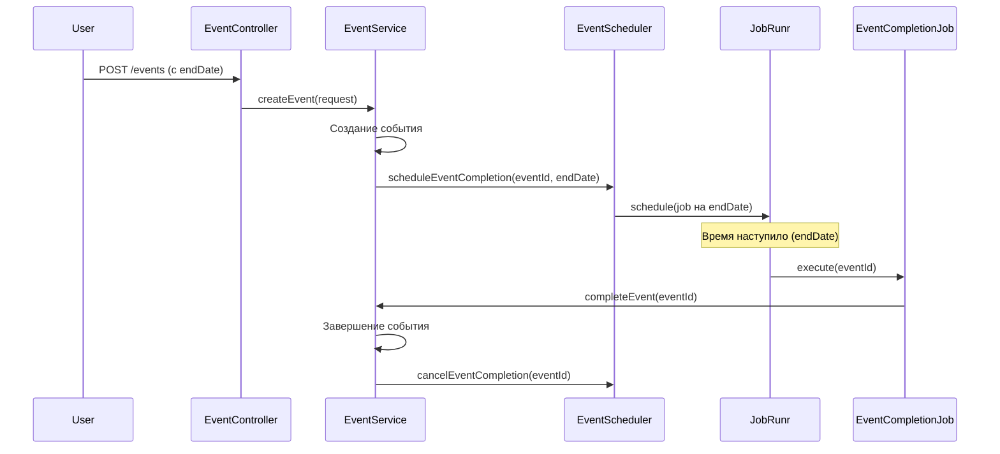
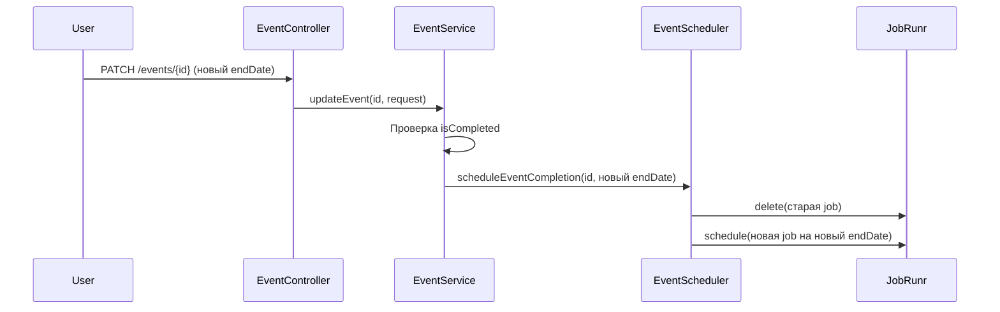

# План завершения событий с JobRunr

## Новые требования
1. **JobRunr** должен анализировать конечную дату события (`endDate`)
2. **Автоматическое завершение** в момент наступления `endDate`
3. **Учет изменения даты** - через PATCH запрос можно менять `endDate`
4. **Перепланирование jobs** при изменении даты

## Архитектура с JobRunr

### 1. JobRunr настройка
Добавить зависимость в `pom.xml`:
```xml
<dependency>
    <groupId>org.jobrunr</groupId>
    <artifactId>jobrunr-spring-boot-starter</artifactId>
    <version>6.3.3</version>
</dependency>
```

### 2. Job сервис для завершения событий
```java
@Service
@RequiredArgsConstructor
public class EventCompletionJobService {
    private final EventService eventService;
    private final EventRepository eventRepository;
    
    @Job(name = "Complete event %0")
    public void completeEventJob(UUID eventId) {
        Event event = eventRepository.findById(eventId)
                .orElseThrow(() -> new EventNotFoundException("Event not found"));
        
        // Проверяем что событие еще не завершено
        if (Boolean.TRUE.equals(event.getIsCompleted())) {
            return; // Уже завершено
        }
        
        // Автоматически завершаем событие
        eventService.completeEvent(eventId);
    }
}
```

### 3. Планирование jobs при создании/обновлении события
```java
@Service
@RequiredArgsConstructor
public class EventSchedulerService {
    private final EventCompletionJobService jobService;
    private final JobScheduler jobScheduler;
    
    public void scheduleEventCompletion(UUID eventId, LocalDateTime endDate) {
        // Удаляем старые jobs для этого события (если есть)
        jobScheduler.delete("Complete event " + eventId);
        
        // Планируем новую job на endDate
        jobScheduler.schedule(endDate, () -> jobService.completeEventJob(eventId));
    }
    
    public void cancelEventCompletion(UUID eventId) {
        jobScheduler.delete("Complete event " + eventId);
    }
}
```

### 4. Интеграция с EventService
```java
@Service
@RequiredArgsConstructor
public class EventService {
    private final EventRepository eventRepository;
    private final EventSchedulerService schedulerService;
    
    @Transactional
    public EventResponse createEvent(EventRequest request) {
        // Существующая логика создания...
        Event event = eventRepository.save(event);
        
        // Планируем автоматическое завершение
        schedulerService.scheduleEventCompletion(event.getId(), request.endDate());
        
        return getEvent(event.getId());
    }
    
    @Transactional
    public EventResponse updateEvent(UUID eventId, EventRequest request) {
        Event event = eventRepository.findById(eventId)
                .orElseThrow(() -> new EventNotFoundException("Event not found"));
        
        checkIfEventIsCompleted(event);
        
        // Если меняется endDate - перепланируем job
        if (request.endDate() != null && !request.endDate().equals(event.getEndDate())) {
            schedulerService.scheduleEventCompletion(eventId, request.endDate());
        }
        
        // Обновляем событие...
        eventRepository.save(event);
        
        return getEvent(eventId);
    }
    
    @Transactional
    public EventResponse completeEvent(UUID eventId) {
        // Существующая логика завершения...
        Event event = eventRepository.findByIdForUpdate(eventId)
                .orElseThrow(() -> new EventNotFoundException("Event not found"));
        
        // Отменяем запланированную job (если есть)
        schedulerService.cancelEventCompletion(eventId);
        
        // Устанавливаем isCompleted = true и создаем payments...
        event.setIsCompleted(true);
        eventRepository.save(event);
        
        // Создаем FINAL payments...
        createFinalPayments(eventId, settlements);
        
        return getEvent(eventId);
    }
}
```

### 5. Job для периодической проверки просроченных событий
```java
@Service
@RequiredArgsConstructor
public class EventCleanupJobService {
    private final EventRepository eventRepository;
    private final EventService eventService;
    
    @RecurringJob(id = "event-cleanup", cron = "0 0 2 * * *") // Каждый день в 2:00
    @Job(name = "Complete expired events")
    public void completeExpiredEvents() {
        LocalDateTime now = LocalDateTime.now();
        
        // Находим события у которых endDate уже прошло, но они не завершены
        List<Event> expiredEvents = eventRepository.findByEndDateBeforeAndIsCompletedFalse(now);
        
        for (Event event : expiredEvents) {
            try {
                eventService.completeEvent(event.getId());
                log.info("Automatically completed expired event: {}", event.getId());
            } catch (Exception e) {
                log.error("Failed to complete expired event {}: {}", event.getId(), e.getMessage());
            }
        }
    }
}
```

### 6. Новые методы в EventRepository
```java
public interface EventRepository extends JpaRepository<Event, UUID> {
    @Query("SELECT e FROM Event e WHERE e.endDate < :now AND e.isCompleted = false")
    List<Event> findByEndDateBeforeAndIsCompletedFalse(@Param("now") LocalDateTime now);
    
    @Query("SELECT e FROM Event e WHERE e.id = :id FOR UPDATE")
    Optional<Event> findByIdForUpdate(@Param("id") UUID id);
}
```

## Диаграмма последовательности с JobRunr



## Учет изменения даты через PATCH


## Порядок реализации

### Фаза 1: JobRunr настройка
1. Добавить зависимость JobRunr в pom.xml
2. Настроить JobRunr в application.yaml
3. Создать `EventCompletionJobService`
4. Создать `EventSchedulerService`

### Фаза 2: Интеграция с EventService
5. Модифицировать `EventService.createEvent()` - планирование job
6. Модифицировать `EventService.updateEvent()` - перепланирование при изменении endDate
7. Модифицировать `EventService.completeEvent()` - отмена запланированной job

### Фаза 3: Периодическая проверка
8. Создать `EventCleanupJobService` для обработки просроченных событий
9. Добавить метод в `EventRepository` для поиска просроченных событий

### Фаза 4: Защита от гонок
10. Добавить `findByIdForUpdate()` в EventRepository
11. Использовать пессимистическую блокировку в `completeEvent()`

## Важные моменты

### 1. Идемпотентность
- `completeEventJob()` проверяет `isCompleted` перед завершением
- JobRunr гарантирует однократное выполнение jobs

### 2. Отмена jobs
- При ручном завершении события отменяем запланированную job
- При изменении endDate удаляем старую job и создаем новую

### 3. Обработка ошибок
- JobRunr имеет встроенные механизмы повторных попыток
- `EventCleanupJobService` ловит исключения для каждого события

### 4. Производительность
- `EventCleanupJobService` выполняется раз в день
- JobRunr использует фоновые потоки, не блокирует основной поток

## Конфигурация JobRunr
```yaml
org:
  jobrunr:
    background-job-server:
      enabled: true
    dashboard:
      enabled: true
    database:
      skip-create: false
    job-scheduler:
      enabled: true
    miscellaneous:
      shutdown-timeout-in-seconds: 30
```

Этот план обеспечивает:
1. Автоматическое завершение событий по `endDate`
2. Перепланирование при изменении даты
3. Защиту от гонок через пессимистические блокировки
4. Отказоустойчивость через JobRunr retry механизмы