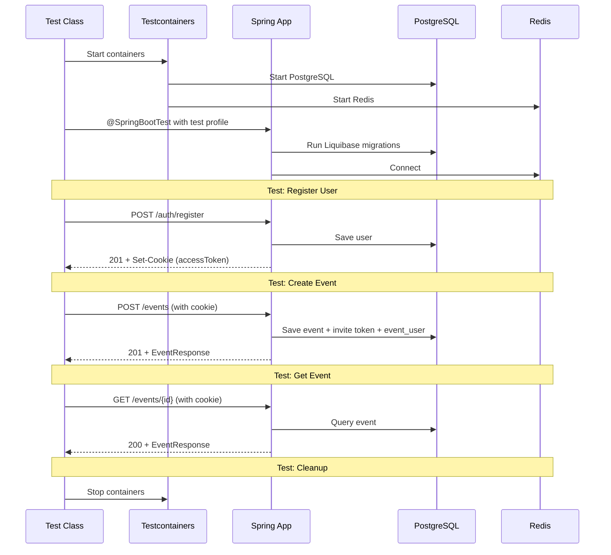

# EventController Integration Tests Plan

## Overview

Integration tests for `EventController` using Spring Boot Test + Testcontainers (PostgreSQL + Redis).  
The tests will verify all REST endpoints of the controller end-to-end, including security, validation, and business logic.

## Architecture

### Test Infrastructure

- **Testcontainers**: PostgreSQL + Redis containers managed via `TestcontainersConfiguration`
- **Test profile**: `application-test.yaml` (already configured with JWT secret, Liquibase, etc.)
- **Auth mechanism**: Register a user via `POST /auth/register`, extract JWT access token from `Set-Cookie` header, then pass it as a cookie in subsequent requests
- **HTTP client**: `TestRestTemplate` or `WebTestClient` (both available in dependencies)

### Key Dependencies to Mock/Stub

- **S3Service**: The `S3Service` interacts with real S3/MinIO. In tests, we need to either:
  - Mock it with `@MockBean` to avoid real S3 calls
  - Or configure it to be inactive
- **Redis**: Already handled by Testcontainers `redisContainer`

### Test Class Structure

```
src/test/java/com/tbank/tevent/event/
  └── EventControllerIntegrationTest.java
```

## Endpoints to Test

| # | Method | Path | Auth Required | Description |
|---|--------|------|---------------|-------------|
| 1 | POST | `/events` | Yes | Create event |
| 2 | GET | `/events/{eventId}` | Yes | Get event by ID |
| 3 | GET | `/events/preview/{token}` | No | Get event preview by invite token |
| 4 | POST | `/events/{token}/apply` | Yes | Apply to event via invite token |
| 5 | PATCH | `/events/{eventId}` | Yes | Update event |
| 6 | GET | `/events/user/events` | Yes | Get user events with filters |
| 7 | GET | `/events/{eventId}/participants` | Yes | Get event participants |
| 8 | DELETE | `/events/{eventId}/participants/{userId}` | Yes | Remove participant (owner only) |
| 9 | DELETE | `/events/{eventId}/exit` | Yes | Leave event |
| 10 | POST | `/events/{eventId}/complete` | Yes | Complete event (owner only) |
| 11 | GET | `/events/{eventId}/token` | Yes | Get invite token (owner only) |

## Test Scenarios

### 1. POST /events - Create Event

**Success case:**
- Register user A
- Create event with valid `EventRequest` (title, startDate, endDate, categories)
- Expect HTTP 201
- Verify response body contains event details (id, title, categories, ownerId, etc.)
- Verify event is persisted in DB

**Validation error cases:**
- Missing title -> HTTP 400
- Missing startDate -> HTTP 400
- Missing endDate -> HTTP 400
- startDate after endDate -> HTTP 400
- startDate in the past -> HTTP 400
- endDate in the past -> HTTP 400

**Unauthorized:**
- No auth cookie -> HTTP 401

### 2. GET /events/{eventId} - Get Event

**Success case:**
- Register user A, create event
- GET event by ID
- Expect HTTP 200
- Verify response matches created event

**Not found:**
- Register user A
- GET with random UUID -> HTTP 404

**Access denied:**
- Register user A, create event
- Register user B
- User B tries to GET event they're not a participant of -> HTTP 403

### 3. GET /events/preview/{token} - Get Event Preview (Public)

**Success case:**
- Register user A, create event
- Extract invite token from DB or from `GET /events/{eventId}/token`
- GET preview by token (no auth required)
- Expect HTTP 200
- Verify preview response contains title, participantCount, creatorInfo

**Invalid token:**
- GET with non-existent token -> HTTP 404

**Expired token:**
- Create event, wait for token to expire (or manipulate DB)
- GET preview with expired token -> HTTP 400

### 4. POST /events/{token}/apply - Apply to Event

**Success case:**
- Register user A, create event
- Register user B
- User B applies via invite token
- Expect HTTP 204
- Verify invitation is created in DB with status PENDING

**Already applied:**
- User B applies again with same token -> HTTP 409

**Already participant:**
- User A (owner) tries to apply -> HTTP 409

**Expired token:**
- Apply with expired token -> HTTP 404

### 5. PATCH /events/{eventId} - Update Event

**Success case:**
- Register user A, create event
- Update event title, description, dates
- Expect HTTP 200
- Verify updated fields in response

**Not owner:**
- Register user B, add as participant to event
- User B tries to update -> HTTP 403

**Completed event:**
- Complete event
- Try to update -> HTTP 400

### 6. GET /events/user/events - Get User Events

**Success case (no filters):**
- Register user A, create 2 events
- GET user events
- Expect HTTP 200
- Verify both events returned

**With filters:**
- Create events with different states, dates
- Filter by state=PLANNED
- Filter by search term
- Filter by date range
- Verify filtered results

### 7. GET /events/{eventId}/participants - Get Participants

**Success case:**
- Register user A, create event
- GET participants
- Expect HTTP 200
- Verify user A is in participants list as OWNER

**Event not found:**
- GET participants with random UUID -> HTTP 404

### 8. DELETE /events/{eventId}/participants/{userId} - Remove Participant

**Success case:**
- Register user A, create event
- Register user B, add B as participant
- User A removes user B
- Expect HTTP 204

**Not owner:**
- User B tries to remove another participant -> HTTP 403

**Remove owner:**
- Try to remove owner from their own event -> HTTP 400

### 9. DELETE /events/{eventId}/exit - Leave Event

**Success case:**
- Register user A, create event
- Register user B, add B as participant
- User B leaves event
- Expect HTTP 204

**Owner cannot leave:**
- User A tries to leave their own event -> HTTP 400

### 10. POST /events/{eventId}/complete - Complete Event

**Success case:**
- Register user A, create event
- Complete event
- Expect HTTP 200
- Verify event state is COMPLETED

**Not owner:**
- User B tries to complete -> HTTP 403

**Already completed:**
- Complete twice -> HTTP 400

### 11. GET /events/{eventId}/token - Get Invite Token

**Success case:**
- Register user A, create event
- GET token
- Expect HTTP 200
- Verify token and expiresAt in response

**Not owner:**
- User B tries to get token -> HTTP 403

## Test Data Setup

### Helper Methods

```java
// Register a user and return the access token cookie
String registerUser(String login, String password);

// Create an event and return the event ID
UUID createEvent(String accessToken, EventRequest request);

// Get invite token for an event
String getInviteToken(String accessToken, UUID eventId);
```

### Test Data Fixtures

```java
EventRequest validEventRequest = new EventRequest(
    "Test Event",
    "Description",
    LocalDateTime.now().plusDays(1),
    LocalDateTime.now().plusDays(2),
    null,
    List.of("Food", "Drinks")
);
```

## Mock Configuration

Since `S3Service` requires real S3/MinIO, we need to mock it:

```java
@MockBean
private S3Service s3Service;
```

This will prevent real S3 calls during tests. The `useKey()` and `generateDownloadUrl()` methods will return null/default values.

## Dependencies

- `spring-boot-starter-test` (JUnit 5, Mockito)
- `spring-boot-testcontainers` (Testcontainers)
- `testcontainers-postgresql`
- `spring-boot-starter-webmvc-test` (WebTestClient or MockMvc)
- `spring-boot-starter-security-test` (Security test support)

## Flow Diagram



## Implementation Notes

1. **Auth flow**: The app uses cookie-based JWT auth. After `POST /auth/register`, the response includes `Set-Cookie` headers. We need to extract the `accessToken` cookie value and pass it in subsequent requests.

2. **TestRestTemplate vs WebTestClient**: `WebTestClient` is more modern and supports reactive testing. However, since this is a standard MVC app, `TestRestTemplate` is simpler. We'll use `TestRestTemplate` with a cookie store.

3. **Transaction management**: Each test should be transactional and roll back after completion. Use `@Transactional` on test methods or clean up manually.

4. **Time-sensitive tests**: For date validation tests, we need to ensure dates are in the future. Use `LocalDateTime.now().plusDays(...)`.

5. **S3 mocking**: `@MockBean` on `S3Service` will prevent real S3 calls. The `useKey()` method is called during event creation - it should be a no-op in tests.