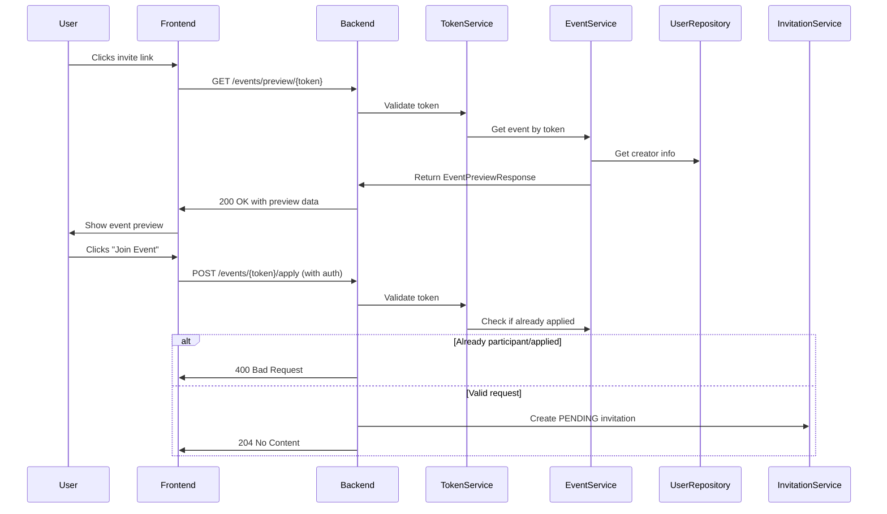
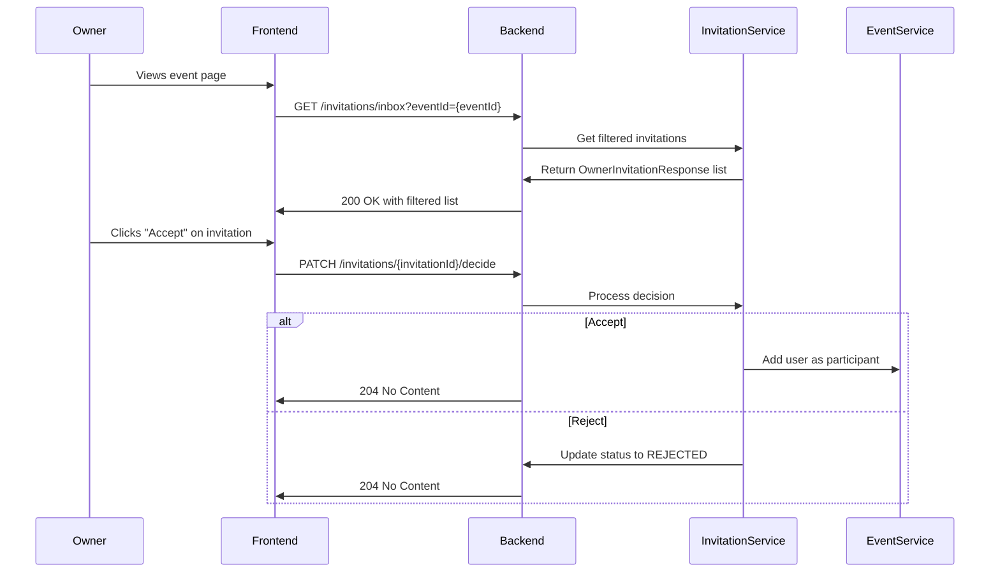
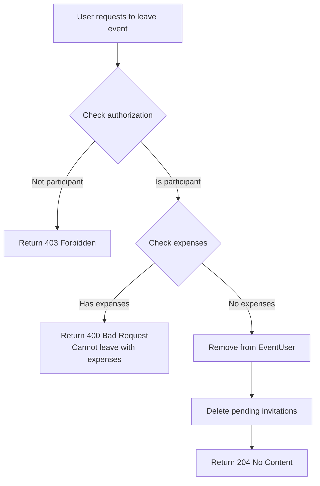
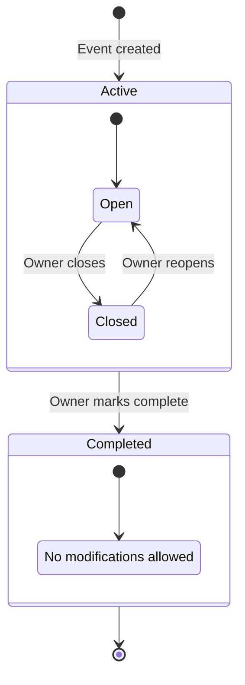

# Event Features Implementation Plan

## Overview
This document outlines the implementation plan for new event-related features requested by the user. The plan includes new endpoints, modifications to existing functionality, and new business logic.

## Workflow Diagrams

### Event Preview and Application Flow


### Invitation Management Flow


### Participant Exit Flow with Expense Check


### Event Completion Flow


## Current System Analysis

### Existing Endpoints
- `GET /events/{eventId}` - Get event details (requires auth)
- `GET /events/{eventId}/token` - Get invite token for event (owner only)
- `GET /invitations/inbox` - Get pending invitations for events owned by current user
- `POST /auth/register` and `POST /auth/login` - Support invite token application via `inviteToken` field

### Existing Data Models
- `Event` - Contains title, description, dates, ownerId, imageKey, inviteTokenId
- `EventResponse` - Returns id, title, description, dates, categories, status, imageUrl, ownerId, countOfParticipants
- `OwnerInvitationResponse` - Returns id, title, login, status, createdAt (missing eventId)
- `User` - Contains login, firstName, secondName, avatarUrl

## New Requirements

### 1. GET /events/preview/{token} (Public)
**Purpose**: Allow users to preview event details before joining (public access, no authentication required).

**Response should include**:
- Event title
- Event avatar/image
- Participant count
- Event date
- Creator info: name, surname, login (fallback), avatar

**Design**:
- New DTO: `EventPreviewResponse`
- New service method in `EventService`: `getEventPreviewByToken(String token)`
- Public endpoint (no `@PreAuthorize`)

### 2. POST /events/{token} (Apply to Event)
**Purpose**: Allow authenticated users to apply/join an event using token.

**Behavior**:
- Creates a PENDING invitation (similar to `inviteService.applyToken()`)
- Returns appropriate response (success/error)
- Should check if user already applied or is already a participant

**Design**:
- New endpoint in `EventController`: `applyToEvent(@PathVariable String token)`
- Uses existing `InviteService.applyToken()` logic
- Returns `ResponseEntity<Void>` or success message

### 3. Enhanced GET /invitations/inbox with eventId Filtering
**Purpose**: Filter invitations by specific event when viewing from event page.

**Current Issue**: Only filters by title comparison, which breaks with duplicate titles.

**Solution**: Add optional `eventId` query parameter to `/invitations/inbox`

**Design**:
- Modify `InvitationController.getIncomingInvitations()` to accept `@RequestParam(required = false) UUID eventId`
- Update `InvitationService.getOwnerInbox()` and repository query to filter by eventId
- Update `OwnerInvitationResponse` to include `eventId` field

### 4. Owner Removal Functionality
**Purpose**: Allow event owner to remove participants from event.

**Constraints**:
- Only owner can remove participants
- Cannot remove owner themselves
- Should check if user has expenses before removal (optional - see requirement 7)

**Design**:
- New endpoint: `DELETE /events/{eventId}/participants/{userId}`
- New service method in `EventMemberService`: `removeParticipant(UUID eventId, UUID userId)`

### 5. Voluntary Exit Functionality
**Purpose**: Allow participants to voluntarily leave an event.

**Constraint**: User can only exit if they have no expenses in the event (as payer or participant in expense splits).

**Design**:
- New endpoint: `DELETE /events/{eventId}/exit`
- New service method: `leaveEvent(UUID eventId)`
- Check expenses via `ExpenseRepository` and `ExpenseSplitRepository`

### 6. Event Completion Functionality
**Purpose**: Allow owner to mark event as completed.

**Behavior**:
- Prevents further modifications
- Closes new invitations
- May prevent new expenses (optional)

**Design**:
- Add `isCompleted` boolean field to `Event` entity (or use status field)
- New endpoint: `POST /events/{eventId}/complete`
- Update validation in relevant services to check completion status

### 7. Update EventResponse with Creator Info
**Purpose**: Include creator details in event responses.

**Design**:
- Create `CreatorInfo` record with firstName, secondName, login, avatarUrl
- Update `EventResponse` to include `creatorInfo` field
- Update `EventMapper` to fetch user details from `UserRepository`

## Data Structure Changes

### New DTOs
```java
// EventPreviewResponse.java
public record EventPreviewResponse(
    UUID eventId,
    String title,
    String imageUrl,
    Long participantCount,
    LocalDateTime startDate,
    LocalDateTime endDate,
    CreatorInfo creatorInfo
) {}

// CreatorInfo.java  
public record CreatorInfo(
    String firstName,
    String secondName,
    String login,
    String avatarUrl
) {}

// Updated OwnerInvitationResponse.java
public record OwnerInvitationResponse(
    UUID id,
    UUID eventId,  // NEW FIELD
    String title,
    String login,
    String status,
    LocalDateTime createdAt
) {}
```

### Entity Changes
```java
// Add to Event.java
@Column(name = "is_completed")
private Boolean isCompleted = false;
```

## API Endpoints Design

### Public Endpoints
```
GET /events/preview/{token}
  - No authentication required
  - Returns EventPreviewResponse
  - 404 if token invalid/expired
```

### Authenticated Endpoints  
```
POST /events/{token}/apply
  - Creates PENDING invitation
  - Returns 204 No Content on success
  - 400 if already applied/participant
  - 404 if token invalid/expired

GET /invitations/inbox?eventId={eventId}
  - Optional eventId filter
  - Returns filtered OwnerInvitationResponse list

DELETE /events/{eventId}/participants/{userId}
  - Owner only
  - Removes participant from event
  - 403 if not owner
  - 400 if user has expenses (optional)

DELETE /events/{eventId}/exit
  - Participant only
  - Allows voluntary exit if no expenses
  - 400 if user has expenses

POST /events/{eventId}/complete
  - Owner only
  - Marks event as completed
  - 403 if not owner
```

## Service Layer Changes

### New Service Methods
1. `EventService.getEventPreviewByToken(String token)` - Public preview
2. `EventService.applyToEvent(String token, UUID userId)` - Apply via token
3. `EventMemberService.removeParticipant(UUID eventId, UUID userId)` - Owner removal
4. `EventMemberService.leaveEvent(UUID eventId, UUID userId)` - Voluntary exit
5. `EventService.completeEvent(UUID eventId)` - Mark event completed

### Repository Updates
1. `InvitationRepository.findOwnerInboxByEventId(UUID ownerId, UUID eventId)` - Filtered query
2. `ExpenseRepository.existsByEventIdAndPayerId(UUID eventId, UUID userId)` - Check payer expenses
3. `ExpenseSplitRepository.existsByEventIdAndUserId(UUID eventId, UUID userId)` - Check split expenses

## Validation Rules

### Expense Check for Exit
User can exit if:
- No expenses where user is payer (`Expense.payerId = userId AND Expense.eventId = eventId`)
- No expense splits where user is participant (`ExpenseSplit.userId = userId` via join with Expense)

### Owner Removal Constraints
Owner can remove participant if:
- Remover is event owner
- Target user is not owner
- (Optional) Target user has no expenses

### Event Completion Constraints
Event can be marked completed if:
- Current user is owner
- Event is not already completed
- (Optional) All expenses are settled

## Security Considerations
1. Public preview endpoint should not leak sensitive information
2. All modification endpoints require proper authorization
3. Token validation must check expiration
4. Rate limiting for public endpoints

## Testing Strategy
1. Integration tests for new endpoints
2. Unit tests for business logic (expense checks, validation)
3. Security tests for authorization rules
4. Edge cases: duplicate titles, expired tokens, concurrent modifications

## Migration Plan
1. Add new fields to entities (backward compatible)
2. Implement new endpoints
3. Update existing responses (CreatorInfo)
4. Add database migrations if needed
5. Deploy and test incrementally

## Dependencies
- No external dependencies required
- Uses existing repositories and services
- May require database migration for new fields