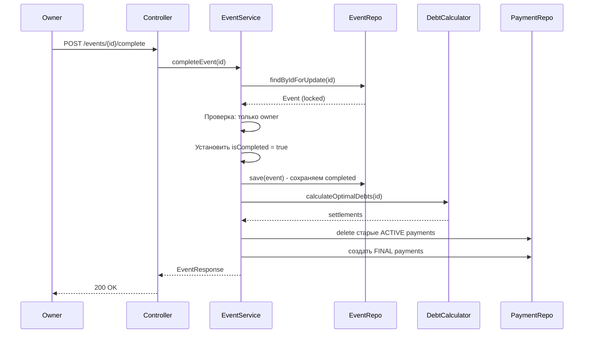

# Финальный план завершения событий

## Основные принципы
1. **Только owner** может завершить событие
2. **Пессимистическая блокировка** `for update` при завершении
3. **Сначала ставим isCompleted = true**, потом рассчитываем payments
4. **Без доп таблиц** - используем существующие payments
5. **Без кэширования** - убираем EventBalanceRepository
6. **Два эндпоинта**: завершение и просмотр final payments

## Последовательность завершения события


## Что нужно реализовать

### 1. Пессимистическая блокировка в EventRepository
```java
@Query("SELECT e FROM Event e WHERE e.id = :id FOR UPDATE")
Optional<Event> findByIdForUpdate(@Param("id") UUID id);
```

### 2. Обновленный completeEvent() метод
```java
@Transactional
public EventResponse completeEvent(UUID eventId) {
    // 1. Блокировка события
    Event event = eventRepository.findByIdForUpdate(eventId)
            .orElseThrow(() -> new EventNotFoundException("Event not found"));

    // 2. Проверка что только owner
    UUID currentUserId = SecurityUtils.getCurrentUserId();
    if (!event.getOwnerId().equals(currentUserId)) {
        throw new AccessDeniedException("Only owner can complete event");
    }

    // 3. Идемпотентность
    if (Boolean.TRUE.equals(event.getIsCompleted())) {
        return getEvent(eventId);
    }

    // 4. СРАЗУ ставим completed = true
    event.setIsCompleted(true);
    eventRepository.save(event); // Сохраняем в рамках транзакции

    // 5. Рассчитываем settlements
    List<SettlementStep> settlements = debtCalculator.calculateOptimalDebts(eventId);
    
    // 6. Создаем FINAL payments
    createFinalPayments(eventId, settlements);

    return getEvent(eventId);
}
```

### 3. Метод createFinalPayments()
```java
private void createFinalPayments(UUID eventId, List<SettlementStep> settlements) {
    // Удаляем старые ACTIVE payments
    paymentRepository.deleteByEventIdAndStatus(eventId, PaymentStatus.ACTIVE);
    
    // Создаем FINAL payments
    for (SettlementStep step : settlements) {
        Payment payment = Payment.builder()
                .eventId(eventId)
                .debtorId(step.debtorId())
                .creditorId(step.creditorId())
                .amount(step.amount())
                .status(PaymentStatus.FINAL)
                .createdAt(LocalDateTime.now())
                .build();
        paymentRepository.save(payment);
    }
}
```

### 4. Эндпоинт GET /events/{eventId}/final-payments
```java
@GetMapping("/{eventId}/final-payments")
public ResponseEntity<?> getFinalPayments(@PathVariable UUID eventId) {
    Event event = eventRepository.findById(eventId)
            .orElseThrow(() -> new EventNotFoundException("Event not found"));
    
    // Проверка что событие завершено
    if (!Boolean.TRUE.equals(event.getIsCompleted())) {
        throw new ValidationException("Event is not completed yet");
    }
    
    // Проверка что пользователь участник
    UUID currentUserId = SecurityUtils.getCurrentUserId();
    eventAccessGuard.requireMember(eventId, currentUserId);
    
    List<Payment> finalPayments = paymentRepository.findByEventIdAndStatus(
        eventId, PaymentStatus.FINAL);
    
    return ResponseEntity.ok(finalPayments);
}
```

### 5. Проверки isCompleted в других сервисах
Добавить в начало методов:
```java
private void checkEventNotCompleted(UUID eventId) {
    Event event = eventRepository.findById(eventId)
            .orElseThrow(() -> new EventNotFoundException("Event not found"));
    
    if (Boolean.TRUE.equals(event.getIsCompleted())) {
        throw new ValidationException("Cannot modify a completed event");
    }
}
```

Методы где нужно добавить проверку:
- `ExpenseCommandService.create()`
- `ExpenseCommandService.update()`
- `ExpenseCommandService.delete()`
- `ExpenseSplitService.createEqualSplits()`
- `ExpenseSplitService.processEqualSplitsDelta()`
- `EventService.updateEvent()`
- `EventMemberService` методы

### 6. Убрать кэширование
- Удалить `EventBalanceRepository redisRepository` из `SettlementQueryService`
- Удалить `InMemoryEventBalanceRepository` или сделать no-op
- Убрать всю логику кэширования

### 7. Обновить PaymentStatus enum
```java
public enum PaymentStatus {
    ACTIVE,      // Активные платежи (до завершения события)
    COMPLETED,   // Оплаченные платежи
    EXPIRED,     // Просроченные платежи
    FINAL        // Финальные платежи после завершения события
}
```

## Порядок реализации

### Фаза 1: Блокировка и завершение
1. Добавить `findByIdForUpdate()` в EventRepository
2. Обновить `completeEvent()` с правильной последовательностью
3. Добавить метод `createFinalPayments()`
4. Обновить PaymentStatus enum

### Фаза 2: Защита от изменений
5. Добавить `checkEventNotCompleted()` метод
6. Добавить проверки в ExpenseCommandService
7. Добавить проверки в ExpenseSplitService
8. Добавить проверки в EventService и EventMemberService

### Фаза 3: Эндпоинты и уборка
9. Создать эндпоинт `GET /events/{eventId}/final-payments`
10. Убрать кэширование из SettlementQueryService
11. Удалить/отключить InMemoryEventBalanceRepository

## Исключения
- `AccessDeniedException("Only owner can complete event")` - при попытке не owner завершить
- `ValidationException("Event is not completed yet")` - при запросе final-payments
- `ValidationException("Cannot modify a completed event")` - при изменении завершенного события

## Важные моменты
1. **Транзакционность**: Весь `completeEvent()` в одной транзакции
2. **Идемпотентность**: Повторный вызов `completeEvent()` возвращает текущее состояние
3. **Блокировка**: `FOR UPDATE` предотвращает гонки при параллельном завершении
4. **Порядок**: Сначала `isCompleted = true`, потом расчет payments - так другие запросы сразу видят что событие завершено