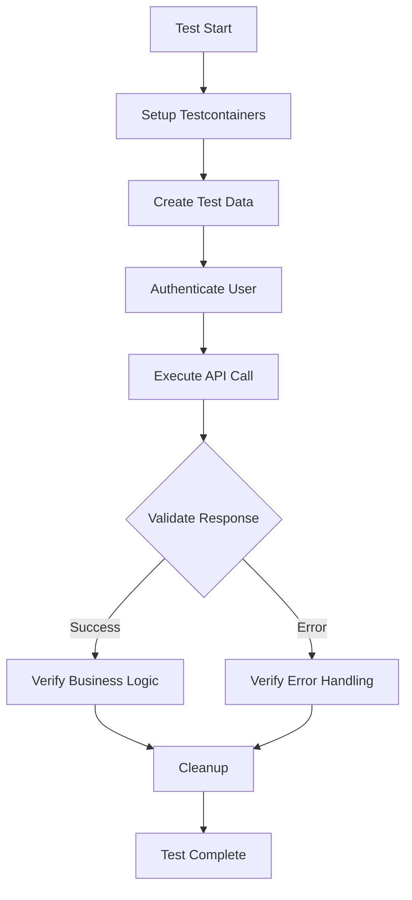

# Comprehensive Integration Test Plan for T-Event Application

## Overview
This document outlines a comprehensive integration test strategy for the T-Event Spring Boot application. The goal is to create end-to-end tests that fully reveal the application logic by covering all REST API endpoints and their interactions.

## Current Test Coverage Analysis

### Existing Integration Tests
- **Auth Module**: Comprehensive tests for login, logout, register, refresh, and me endpoints
- **Event Module**: Basic event creation and retrieval tests  
- **Expenses Module**: Expense creation, retrieval, and participant inbox tests
- **S3 Module**: File upload/download URL generation tests

### Identified Gaps
The following modules lack integration tests:
1. **Event History Controller** (`/events/{eventId}/history`)
2. **User Profile Controller** (`/me`)
3. **Invitation Controller** (`/invitations`)
4. **Notification Controller** (`/notifications`)
5. **Payment Controller** (`/events/{eventId}/payments`)
6. **Settlement Controller** (`/events/{eventId}/settlements`)
7. **Category Module** (no controller found but has service)

## Test Strategy

### 1. Test Architecture
- Use **Testcontainers** with PostgreSQL for database integration
- Use **MockMvc** or **WebTestClient** for HTTP endpoint testing
- Follow existing patterns from `AbstractAuthIntegrationTest`
- Include authentication/authorization testing for protected endpoints
- Test error scenarios and edge cases

### 2. Test Categories
For each REST endpoint, tests should cover:
- **Happy Path**: Successful operations with valid data
- **Validation**: Invalid input handling (400 Bad Request)
- **Authentication**: Unauthorized access (401 Unauthorized)
- **Authorization**: Forbidden access (403 Forbidden)  
- **Error Scenarios**: Resource not found (404), conflicts, etc.
- **Business Logic**: Complex workflows and state transitions

## Detailed Test Plan by Module

### Module 1: Auth (Extend Existing)
**Endpoints**: `/auth/register`, `/auth/login`, `/auth/logout`, `/auth/refresh`, `/auth/me`
- [x] Existing tests cover basic flows
- [ ] Add tests for concurrent sessions
- [ ] Add tests for token expiration scenarios
- [ ] Add tests for rate limiting (if implemented)

### Module 2: Events (Extend Existing)
**Endpoints**: `/events` (GET, POST, PUT, DELETE), `/events/{id}`, `/events/{id}/participants`
- [x] Existing tests cover basic CRUD
- [ ] Add tests for event filtering and pagination
- [ ] Add tests for participant management
- [ ] Add tests for event status transitions
- [ ] Add tests for access control (owner vs participant)

### Module 3: Event History (New)
**Endpoints**: `/events/{eventId}/history`
- [ ] Test history retrieval for valid event
- [ ] Test history pagination
- [ ] Test unauthorized access to other events
- [ ] Test history entry creation via event modifications

### Module 4: User Profile (New)
**Endpoints**: `/me` (GET, PUT), `/me/password`
- [ ] Test profile retrieval with authentication
- [ ] Test profile update validation
- [ ] Test password change with old password verification
- [ ] Test unauthorized access without tokens

### Module 5: Invitations (New)
**Endpoints**: `/invitations` (GET, POST, PUT for decisions)
- [ ] Test invitation creation for events
- [ ] Test invitation acceptance/rejection
- [ ] Test invitation list for user
- [ ] Test invitation expiration
- [ ] Test access control (only event owners can invite)

### Module 6: Notifications (New)
**Endpoints**: `/notifications` (GET, PUT for marking read)
- [ ] Test notification list with pagination
- [ ] Test marking notifications as read
- [ ] Test notification generation from events
- [ ] Test real-time updates (if WebSocket implemented)

### Module 7: Expenses (Extend Existing)
**Endpoints**: `/events/{eventId}/expenses`, `/expenses/participant`
- [x] Existing tests cover basic expense creation
- [ ] Add tests for expense splitting logic
- [ ] Add tests for participant inbox
- [ ] Add tests for expense categories
- [ ] Add tests for settlement calculations

### Module 8: Payments (New)
**Endpoints**: `/events/{eventId}/payments`
- [ ] Test payment initiation
- [ ] Test payment confirmation
- [ ] Test payment status transitions
- [ ] Test payment expiration cleanup
- [ ] Test payment history

### Module 9: Settlements (New)
**Endpoints**: `/events/{eventId}/settlements`
- [ ] Test settlement calculation
- [ ] Test settlement list retrieval
- [ ] Test settlement steps (who pays whom)
- [ ] Test settlement completion

### Module 10: S3 (Extend Existing)
**Endpoints**: `/s3/upload-url`, `/s3/download-url`
- [x] Existing tests cover URL generation
- [ ] Add tests for file validation
- [ ] Add tests for cleanup scheduler
- [ ] Add tests for access control to event images

### Module 11: Categories (New - if endpoints exist)
**Potential Endpoints**: `/categories` or event-category associations
- [ ] Test category creation/retrieval
- [ ] Test category assignment to events
- [ ] Test category validation

## Test Implementation Approach

### Phase 1: Foundation (Week 1)
1. Create base test classes for consistent setup
2. Implement test utilities for authentication, data creation
3. Set up Testcontainers configuration for all modules

### Phase 2: Core Business Logic (Week 2-3)
1. Implement tests for Event History, User Profile, Invitations
2. Implement tests for Notifications, Payments, Settlements
3. Extend existing Auth and Event tests with edge cases

### Phase 3: Complex Workflows (Week 4)
1. Implement end-to-end scenarios:
   - User registration → Event creation → Invitations → Expenses → Settlements → Payments
   - Complete event lifecycle from creation to settlement
2. Test concurrent operations and race conditions
3. Test data consistency across modules

### Phase 4: Performance & Security (Week 5)
1. Add performance tests for critical paths
2. Add security tests for authorization bypass attempts
3. Add resilience tests (database failures, network issues)

## Test Data Management

### Data Factory Pattern
Create test data factories for:
- User creation with authentication
- Event creation with participants
- Expense creation with splits
- Invitation creation with tokens

### Database Cleanup
- Use `@Transactional` or manual cleanup after each test
- Consider using database reset strategies
- Ensure tests are independent and idempotent

## Technical Implementation Details

### Test Structure
```java
@ActiveProfiles("test")
@AutoConfigureMockMvc
@SpringBootTest
@Import(TestcontainersConfiguration.class)
class ModuleIntegrationTest {
    // Test methods organized by endpoint
    // Helper methods for authentication
    // Factory methods for test data
}
```

### Authentication Helper
```java
protected String authenticateUser(String login, String password) {
    // Returns JWT token or sets cookies
}
```

### Test Coverage Goals
- Line coverage: >80% for service layer
- Branch coverage: >70% for complex logic
- API endpoint coverage: 100%

## Success Metrics
1. All REST endpoints have at least one happy path test
2. All business error scenarios are covered
3. Tests run in CI pipeline with <5 minute execution time
4. Tests are maintainable and readable
5. Tests reveal actual application logic and workflows

## Next Steps
1. Review this plan with development team
2. Prioritize modules based on business criticality
3. Begin implementation with Phase 1 foundation
4. Regularly update plan as new endpoints are added

## Mermaid Diagram: Test Execution Flow


## Risk Mitigation
- **Flaky Tests**: Use fixed test data, avoid timing dependencies
- **Slow Execution**: Parallel test execution, optimized container reuse
- **Maintenance Burden**: Consistent patterns, documentation, helper utilities
- **False Positives**: Comprehensive assertions, not just status codes